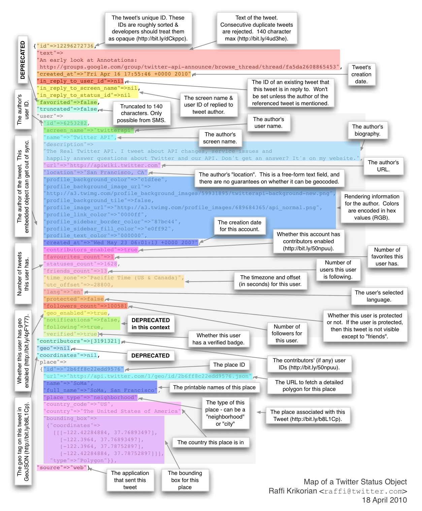

# First : 
	Create a Twitter user account if you do not already have one.
# Second : 
	Go to https://apps.twitter.com/ and log in with your Twitter user account. This step gives you a Twitter dev account under the same name as your 

## Follow the steps in the links :
	http://socialmedia-class.org/twittertutorial.html

	install twitter by : pip3 install twitter

	install twython by : pip3 install twython
## Run the twython_search_eample.py
	python3 twython_search_eample.py
	
## Run the stream_api.py
	Remember to change the your_information in the file to run

	python3 stream_api.py > twitter_stream_1000tweets.txt

## Run the preprocess_tweets.py
	python3 preprocess_tweets.py

## Run the search_trends_api.py
	python3 search_trends_api.py

## Data format figure example :
	

## Reference : 
	https://github.com/sixohsix/twitter/